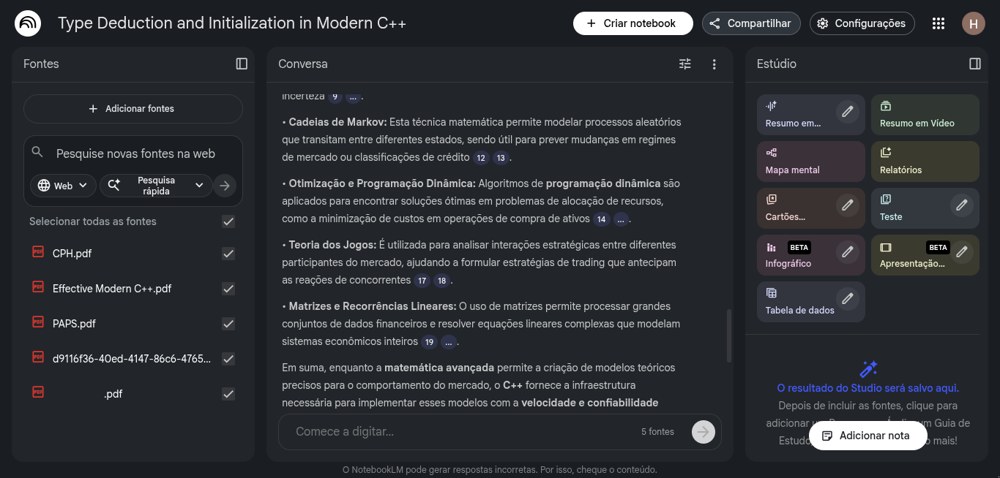

# Potencialize Seus Estudos com NotebookLM

## O que é o NotebookLM?

NotebookLM é uma ferramenta inovadora desenvolvida pelo Google AI, projetada para ser seu assistente de pesquisa e estudo pessoal. Ele utiliza modelos de linguagem avançados para processar e compreender grandes volumes de informações, permitindo que você interaja com seus materiais de estudo de uma maneira totalmente nova.

## Por que usar o NotebookLM para seus estudos?

*   **Organização Centralizada:** Carregue diversos formatos de documentos (PDFs, Google Docs, etc.) e tenha todo o seu material de estudo em um só lugar.
*   **Resumos Rápidos:** Obtenha resumos concisos de textos longos, economizando tempo e focando nos pontos chave.
*   **Perguntas e Respostas:** Faça perguntas sobre seu material e receba respostas detalhadas e contextuais, como se estivesse conversando com um especialista no assunto.
*   **Geração de Ideias:** Utilize o NotebookLM para gerar ideias, rascunhos e estruturas para seus trabalhos e projetos, superando bloqueios criativos.
*   **Conexões Inteligentes:** A ferramenta pode ajudar a identificar conexões e insights entre diferentes documentos, enriquecendo sua compreensão.
*   **Flashcards e Material de Revisão:** Crie automaticamente flashcards, quizzes e outros materiais de revisão a partir de seus documentos.

## Como usar o NotebookLM para Turbinar Seus Estudos:

1.  **Carregue Seus Materiais:** Comece importando seus PDFs de artigos, livros, anotações de aula, transcripts de palestras ou Google Docs para o NotebookLM.
2.  **Explore e Pergunte:** Uma vez que seus documentos são processados, você pode começar a fazer perguntas específicas ou pedir resumos sobre tópicos dentro do seu material.
    *   Exemplo: "Quais são os principais argumentos do autor no capítulo 3 deste livro?"
    *   Exemplo: "Crie um resumo dos pontos mais importantes do artigo 'Inteligência Artificial e o Futuro do Trabalho'."
3.  **Gere Conteúdo:** Peça ao NotebookLM para gerar rascunhos de ensaios, brainstorm de ideias para um projeto ou até mesmo um script para uma apresentação, tudo baseado nos seus documentos carregados.
    *   Exemplo: "Gere um plano de estudo para o tema 'História da Filosofia Moderna' baseado nos meus documentos."
4.  **Crie Materiais de Estudo:** Utilize a capacidade do NotebookLM para criar flashcards ou perguntas de múltipla escolha para autoavaliação.
    *   Exemplo: "Crie 10 flashcards sobre os conceitos chave da 'Termodinâmica' presentes nos meus PDFs."

## Dicas para Aproveitar ao Máximo:

*   **Seja Específico:** Quanto mais específica for sua pergunta ou solicitação, melhor será a resposta do NotebookLM.
*   **Revise Sempre:** Lembre-se de que o NotebookLM é uma ferramenta de apoio. Sempre revise e verifique as informações geradas para garantir precisão e relevância.
*   **Experimente:** Não tenha medo de experimentar diferentes tipos de perguntas e solicitações para descobrir como a ferramenta pode melhor se adequar ao seu estilo de estudo.

NotebookLM é uma ferramenta poderosa que pode transformar a maneira como você estuda e pesquisa, tornando o processo mais eficiente e produtivo. Comece a usá-lo hoje e descubra um novo nível de aprendizado!
