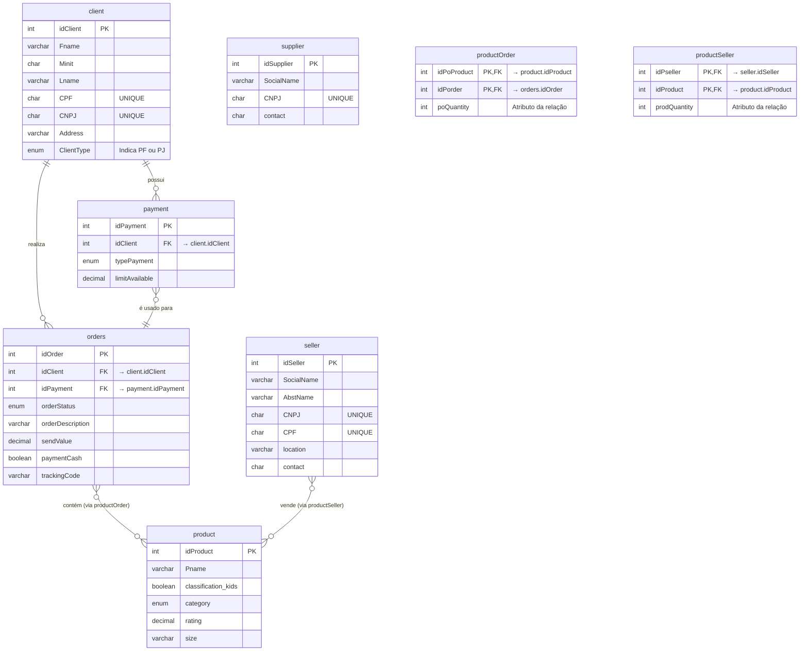

# Projeto de Banco de Dados para E-commerce

Este projeto consiste na criação de um esquema de banco de dados para um sistema de e-commerce, desenvolvido como parte de um desafio de projeto. O script SQL (`Ecommerce - Scripts.sql`) inclui a criação das tabelas (DDL), a inserção de dados de exemplo (DML) e uma série de consultas (queries) para extrair informações relevantes do negócio.

## Descrição do Projeto Lógico

O modelo de dados foi projetado para suportar as operações fundamentais de uma plataforma de e-commerce, incluindo o gerenciamento de clientes, produtos, pedidos, pagamentos, estoque, fornecedores e vendedores.

As principais entidades são:

*   **Cliente (`client`):** Armazena informações sobre os clientes. O modelo foi refinado para suportar tanto Pessoas Físicas (PF), identificadas por CPF, quanto Pessoas Jurídicas (PJ), identificadas por CNPJ.
*   **Produto (`product`):** Contém detalhes sobre os produtos à venda, como nome, categoria e avaliação.
*   **Pedido (`orders`):** Registra os pedidos feitos pelos clientes, incluindo status da entrega e código de rastreio.
*   **Pagamento (`payment`):** Permite que um cliente tenha múltiplas formas de pagamento cadastradas.
*   **Fornecedor (`supplier`):** Armazena dados dos fornecedores de produtos.
*   **Vendedor (`seller`):** Gerencia os vendedores da plataforma, que podem ser tanto pessoas físicas (CPF) quanto jurídicas (CNPJ).
*   **Estoque (`productSeller`):** Controla a quantidade de cada produto por vendedor, servindo como a tabela central para a gestão de estoque.

## Esquema Entidade-Relacionamento (EER)

O diagrama abaixo representa a estrutura lógica e os relacionamentos entre as tabelas do banco de dados.

<details>
<summary>Clique para expandir o diagrama EER</summary>



</details>

## Otimizações e Refinamentos Aplicados

Com base no script inicial, foram aplicadas diversas melhorias para aumentar a robustez, consistência e eficiência do banco de dados, alinhando-o com as melhores práticas de engenharia de software.

### 1. Consistência e Clareza do Schema

*   **Precisão de Tipos de Dados:** O tipo `FLOAT` foi substituído por `DECIMAL` para colunas que armazenam valores monetários (`sendValue`, `limitAvailable`) e avaliações (`rating`). Isso evita problemas de arredondamento e garante a precisão financeira e de métricas.
*   **Flexibilidade de Colunas:** Os tamanhos de colunas `VARCHAR` como `Pname` e `Address` foram aumentados para acomodar dados mais realistas e evitar truncamento de informações.
*   **Consistência de Nomenclatura:** A chave estrangeira `idOrderClient` na tabela `orders` foi renomeada para `idClient`, padronizando o nome com a coluna que ela referencia na tabela `client`.

### 2. Validação e Integridade dos Dados

*   **Validação de Documentos:** O tamanho da coluna `CNPJ` foi corrigido de `CHAR(15)` para `CHAR(14)`, que é o padrão correto no Brasil.
*   **Regras de Negócio com `CHECK`:** Foi adicionada uma restrição (`CONSTRAINT CHECK`) na tabela `seller` para garantir que um vendedor seja obrigatoriamente cadastrado com um CPF ou um CNPJ, reforçando a integridade dos dados.

### 3. Otimização de Consultas (Queries)

*   **Consulta de Pedidos por Cliente:** A consulta foi aprimorada utilizando `LEFT JOIN` em vez de `JOIN`. Isso garante que todos os clientes sejam listados no resultado, mesmo aqueles que ainda não realizaram nenhum pedido, fornecendo uma visão mais completa.
*   **Consulta de Vendedor/Fornecedor:** A lógica para identificar se um vendedor também é um fornecedor foi tornada mais robusta. A junção agora compara apenas os campos `CNPJ`, que é um identificador único e confiável para pessoas jurídicas, em vez de uma frágil comparação entre CPF e telefone de contato.

## Queries e Análise de Dados

O script SQL contém uma seção dedicada a consultas que respondem a perguntas de negócio importantes, tais como:

*   Quantos pedidos foram feitos por cada cliente?
*   Quais vendedores também atuam como fornecedores?
*   Qual a relação entre produtos, fornecedores e estoques?
*   Qual a quantidade total de cada produto em estoque?

Essas queries demonstram o uso de cláusulas SQL avançadas como `JOIN`, `GROUP BY`, `HAVING` e `ORDER BY` para realizar análises complexas.

## Como Utilizar

1.  **Pré-requisitos:** Certifique-se de ter o Docker e um cliente SQL (como DBeaver, MySQL Workbench ou Beekeeper Studio) instalados.
2.  **Iniciar o Banco de Dados:** No terminal, execute o comando abaixo para iniciar um contêiner Docker com o servidor MySQL.
    ```bash
    sudo docker run --name dev-mysql -p 3306:3306 -e MYSQL_ALLOW_EMPTY_PASSWORD=yes -d mysql:8 --default-authentication-plugin=mysql_native_password
    ```
3.  **Executar o Script:** Conecte-se ao servidor de banco de dados usando seu cliente SQL (Host: `127.0.0.1`, Usuário: `root`, sem senha) e execute o conteúdo do arquivo `Ecommerce - Scripts.sql`.
4.  **Pronto!** O banco de dados `ecommerce` estará criado e populado, pronto para ser utilizado.

## Melhorias Propostas

Apesar de funcional, o esquema atual pode ser aprimorado com as seguintes sugestões:

1.  **Performance (Índices):** Adicionar índices em todas as colunas de Chave Estrangeira (FK) para acelerar drasticamente as consultas que utilizam `JOIN`.
    *   **Exemplo:** `CREATE INDEX idx_orders_client ON orders(idClient);`

2.  **Normalização do Endereço:** A coluna `Address` na tabela `client` poderia ser dividida em colunas estruturadas (`rua`, `cidade`, `estado`, `cep`), facilitando consultas e a padronização dos dados.

3.  **Consistência de Dados:** O campo `size` na tabela `product` poderia ser convertido para um `ENUM` para garantir que apenas valores padronizados ('Pequeno', 'Médio', 'Grande') sejam inseridos.

4.  **Clareza na Lógica de Negócio:**
    *   O campo `paymentCash` na tabela `orders` é potencialmente redundante, dado que a tabela `payment` já especifica o método de pagamento. Sua remoção poderia simplificar o esquema.
    *   A descrição do pedido na `Stored Procedure` poderia ser mais informativa, utilizando o nome do produto (`Pname`) em vez do seu ID.
