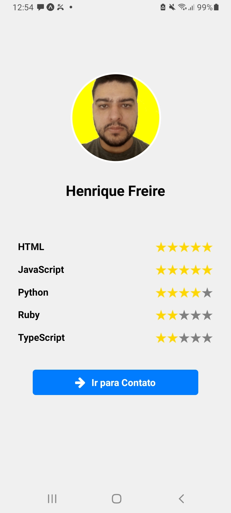
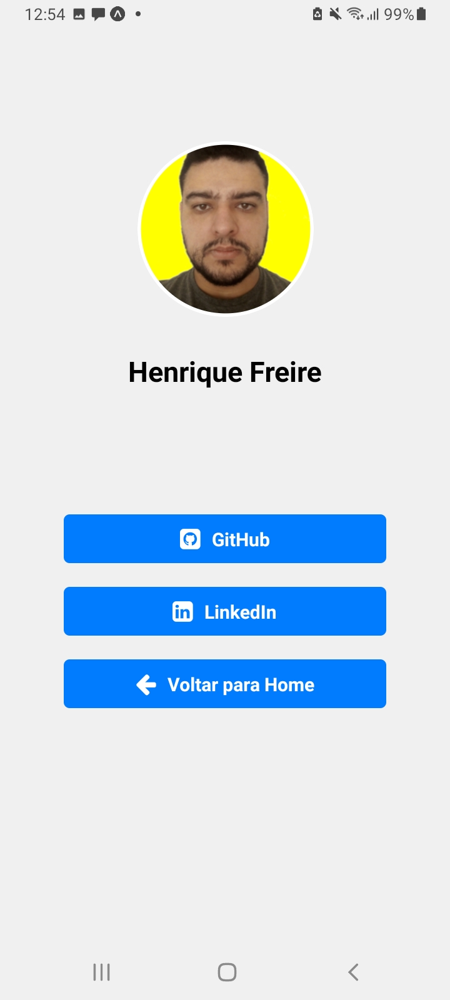

# App de Portfólio

Este é um aplicativo de portfólio desenvolvido em React Native, projetado para exibir suas habilidades, projetos e informações de contato de forma clara e profissional.

## Funcionalidades

- **Perfil Personalizado**: Exiba sua foto, nome e uma breve biografia.
- **Habilidades**: Apresente suas principais linguagens de programação e tecnologias com um sistema de classificação por estrelas.
- **Projetos**: (A ser implementado) Uma seção dedicada para listar e descrever seus projetos.
- **Contato**: Botões diretos para suas redes sociais (GitHub, LinkedIn).
- **Design Responsivo**: Layout adaptável para diferentes tamanhos de tela.

## Screenshots

### Tela Inicial (Home)



_Adicione aqui uma breve descrição da tela inicial._

### Tela de Contato



_Adicione aqui uma breve descrição da tela de contato._

## Instalação

Para configurar e rodar o projeto localmente, siga os passos abaixo:

1.  **Clone o repositório:**

    ```bash
    git clone https://github.com/SEU_USUARIO/SEU_REPOSITORIO.git
    cd SEU_REPOSITORIO
    ```

2.  **Instale as dependências:**

    ```bash
    npm install
    # ou yarn install
    ```

3.  **Configure o Token do GitHub (Opcional, mas recomendado):**

    Crie um arquivo `.env` na raiz do projeto e adicione seu token do GitHub:

    ```
    EXPO_PUBLIC_GITHUB_TOKEN=SEU_TOKEN_AQUI
    ```

    Substitua `SEU_TOKEN_AQUI` pelo seu Personal Access Token do GitHub. Isso ajuda a evitar limites de taxa da API do GitHub.

    **Como gerar um Personal Access Token (PAT) no GitHub:**
    1.  Vá para as **Configurações** do seu perfil no GitHub.
    2.  No menu lateral esquerdo, clique em **Developer settings**.
    3.  Clique em **Personal access tokens** e depois em **Tokens (classic)**.
    4.  Clique em **Generate new token**.
    5.  Dê um nome descritivo ao seu token (ex: `portfolio-app`).
    6.  Defina a expiração do token (recomendado: 30 dias ou 90 dias).
    7.  Marque o escopo `public_repo` (ou `repo` se precisar de acesso a repositórios privados).
    8.  Clique em **Generate token**.
    9.  **Copie o token gerado imediatamente!** Ele não será exibido novamente.

4.  **Inicie o aplicativo:**

    ```bash
    npx expo start
    ```

    Se você tiver problemas com a porta, tente:

    ```bash
    npx expo start -c --port 8082
    ```

    Isso abrirá o Metro Bundler no seu navegador. Você pode então escanear o QR code com o aplicativo Expo Go no seu celular ou rodar em um emulador.

## Uso

Após a instalação, o aplicativo será iniciado e você poderá navegar entre as telas de perfil e contato. Preencha suas informações no `UserContext.tsx` e atualize os links dos botões de contato.

## Contribuição

Contribuições são bem-vindas! Sinta-se à vontade para abrir issues e pull requests.

## Licença

Este projeto está licenciado sob a Licença MIT. Veja o arquivo [LICENSE](LICENSE) para mais detalhes.
