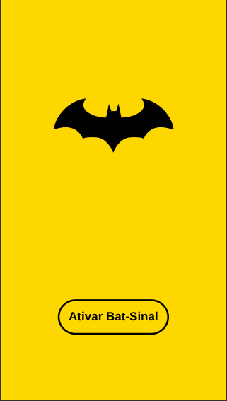
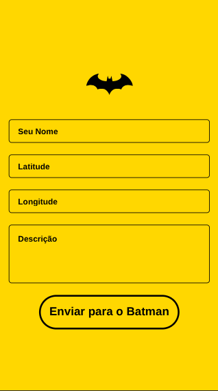

# Bat-Sinal App


---

## 🦇 Sobre o Projeto

O **Bat-Sinal App** é uma aplicação móvel que permite aos cidadãos de Gotham City enviar um sinal de socorro diretamente para o Batman. Com este aplicativo, qualquer pessoa pode relatar uma emergência, fornecendo sua localização e uma breve descrição da situação, garantindo que a ajuda do Cavaleiro das Trevas chegue o mais rápido possível.

---

## ✨ Funcionalidades

- **Envio de Sinal de Socorro:** Formulário simples e intuitivo para enviar um chamado de emergência.
- **Geolocalização:** Campos para inserção de latitude e longitude para localização precisa.
- **Descrição da Emergência:** Área de texto para detalhar a situação.
- **Interface Temática:** Design inspirado no universo do Batman para uma experiência imersiva.

---

## 🚀 Tecnologias Utilizadas

- **React Native:** Framework para desenvolvimento de aplicativos móveis multiplataforma.
- **Expo:** Plataforma para facilitar o desenvolvimento e a publicação de aplicativos React Native.
- **TypeScript:** Superset do JavaScript que adiciona tipagem estática ao código.
- **React Navigation:** Biblioteca para gerenciamento de navegação entre telas.

---

## 🏁 Começando

Siga as instruções abaixo para configurar e executar o projeto em seu ambiente de desenvolvimento local.

### Pré-requisitos

- [Node.js](https://nodejs.org/en/)
- [npm](https://www.npmjs.com/) ou [Yarn](https://yarnpkg.com/)
- [Expo CLI](https://docs.expo.dev/get-started/installation/)

### Instalação

1. Clone o repositório:
   ```sh
   git clone https://github.com/seu-usuario/bat-sinal-app.git
   ```
2. Navegue até o diretório do projeto:
   ```sh
   cd bat-sinal-app
   ```
3. Instale as dependências:
   ```sh
   npm install
   ```

### Executando o Aplicativo

Para iniciar o aplicativo em modo de desenvolvimento, execute o seguinte comando:

```sh
npm start
```

Isso iniciará o Metro Bundler do Expo. Você pode então escanear o código QR com o aplicativo Expo Go em seu dispositivo móvel (Android ou iOS) ou executar o aplicativo em um emulador.

---

## 📸 Screenshots

| Tela Inicial | Tela de Registro | Tela de Envio |
| :----------: | :--------------: | :------------: |
|  |  | <video src="screenshots/send_complete_demo.mp4" controls muted loop playsinline style="max-width: 100%; height: auto;"></video> |

---

## 🤝 Contribuindo

Contribuições são o que tornam a comunidade de código aberto um lugar incrível para aprender, inspirar e criar. Qualquer contribuição que você fizer será **muito apreciada**.

1. Faça um *fork* do projeto.
2. Crie uma nova *branch* (`git checkout -b feature/nova-funcionalidade`).
3. Faça o *commit* de suas alterações (`git commit -m 'Adiciona nova funcionalidade'`).
4. Faça o *push* para a *branch* (`git push origin feature/nova-funcionalidade`).
5. Abra um *Pull Request*.

---

## 📝 Licença

Distribuído sob a licença MIT. Veja `LICENSE` para mais informações.
