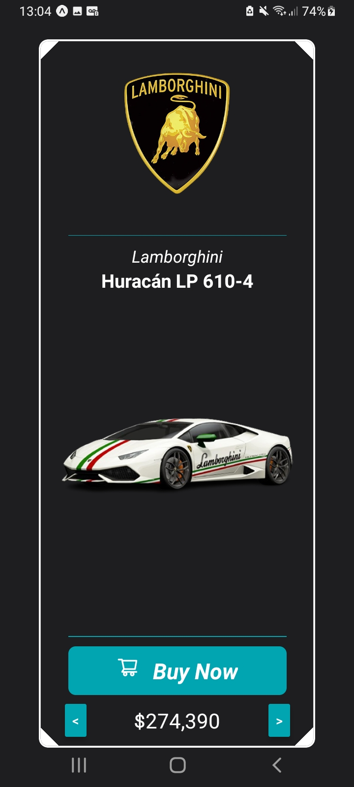
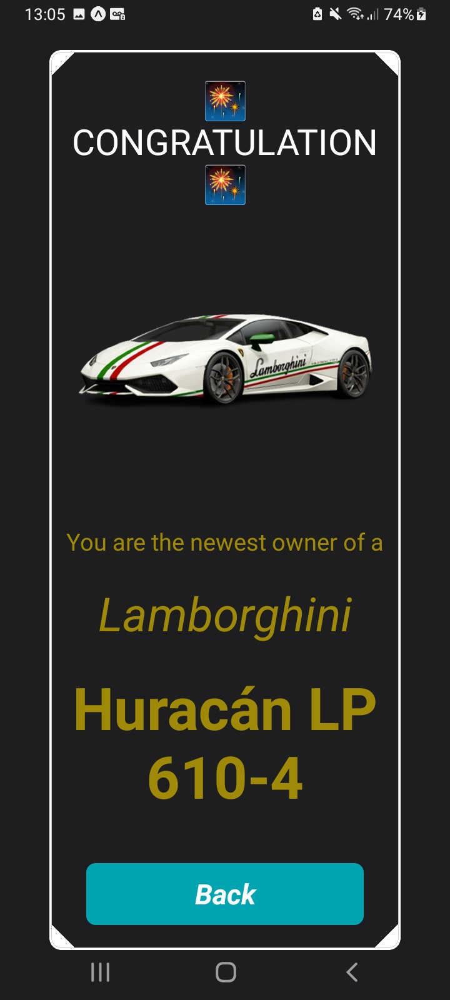

# Lamborghini Garage

Um aplicativo móvel para visualizar uma garagem de carros da Lamborghini.

## Funcionalidades

- Visualizar uma lista de carros da Lamborghini.
- Navegar entre os carros.
- Simular a compra de um carro.
- Tela de parabenização após a compra.

## Melhorias Visuais

Para melhorar a experiência do usuário em dispositivos Android, foram realizadas as seguintes alterações:

- **Barra de Status:** Os ícones da barra de status (como bateria, Wi-Fi e horas) foram definidos para a cor branca, garantindo uma boa visibilidade em contraste com o fundo escuro do aplicativo.
- **Barra de Navegação:** Os botões da barra de navegação do sistema (como "voltar", "home" e "recentes") também foram definidos para a cor branca, mantendo a consistência visual e a usabilidade em ambientes com pouca luz.

Essas alterações garantem que a interface do aplicativo seja visualmente coesa e agradável, proporcionando uma experiência de usuário mais imersiva e profissional.

## Telas

**Tela da Garagem**



**Tela de Parabenização**



## Tecnologias Utilizadas

- [React Native](https://reactnative.dev/)
- [Expo](https://expo.dev/)
- [TypeScript](https://www.typescriptlang.org/)
- [React Navigation](https://reactnavigation.org/)
- [Axios](https://axios-http.com/)

## Como Executar o Projeto

1.  Clone o repositório:

    ```bash
    git clone https://github.com/seu-usuario/lamborghini-garage.git
    ```

2.  Instale as dependências:

    ```bash
    npm install
    ```

3.  Inicie o projeto:

    ```bash
    npm start
    ```

## API

O aplicativo utiliza a seguinte API para buscar os dados dos carros:

[https://digitalinnovationone.github.io/fake-data-api-lamborghini/api/lamborghini.json](https://digitalinnovationone.github.io/fake-data-api-lamborghini/api/lamborghini.json)